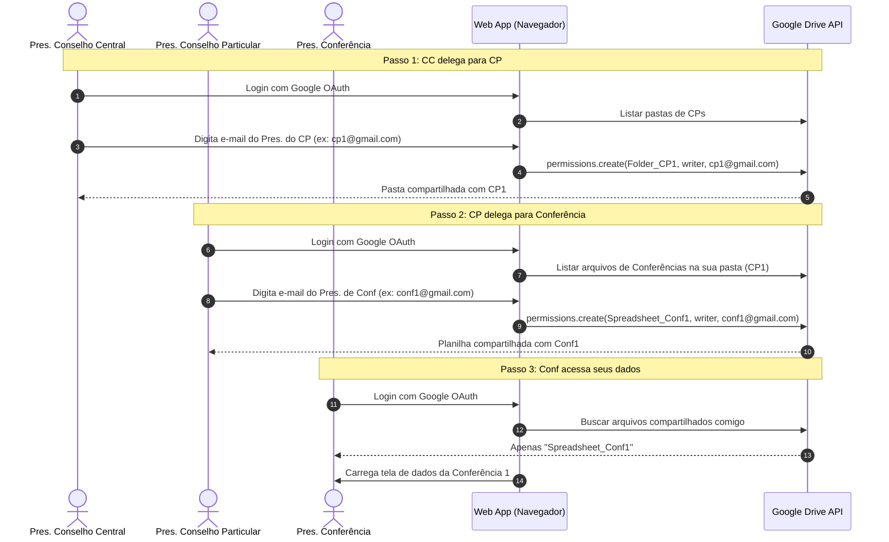

# Discussão de Segurança - Alternativas Contra Vazamentos no Google Sheets
**Data**: 18 de Agosto de 2026  
**Participantes**: Arquiteto AI & Desenvolvedor SSVP  

---

## 1. Contexto Atual
A arquitetura proposta consiste em:
* Cada Conselho Central possui sua planilha em seu Google Drive.
* A conta `ssvpweb@gmail.com` possui permissão de edição nessas planilhas.
* O aplicativo web se conecta utilizando as credenciais dessa conta central para ler e gravar dados.

### Vulnerabilidade Identificada (SPOF)
Se as credenciais de `ssvpweb@gmail.com` forem interceptadas ou vazarem (seja via engenharia social, invasão do servidor ou inspeção do cliente no browser), o invasor ganha acesso de leitura e escrita a **todas** as planilhas de todos os Conselhos Centrais cadastrados.

---

## 2. Alternativas Propostas para Melhorar a Segurança

Abaixo, comparamos 3 alternativas técnicas para mitigar esse risco de vazamento:

### Alternativa 1: Criptografia de Colunas no Lado do Cliente (Client-Side Encryption)
* **Como funciona**: O aplicativo criptografa dados confidenciais (Nome, Endereço, Senha) no próprio celular do voluntário usando uma chave secreta antes de enviar para o Google Sheets. A chave pode ser derivada da própria senha do usuário.
* **Prós**: 
  * Se a planilha do Drive vazar ou a conta `ssvpweb@gmail.com` for hackeada, o invasor verá apenas caracteres ilegíveis nas colunas confidenciais.
* **Contras**:
  * Impossibilita o uso de filtros nativos do Google Sheets por Nome ou Endereço (toda a filtragem precisa ser feita no celular do usuário).
  * Se o usuário esquecer a senha/chave, os dados criptografados correspondentes serão perdidos para sempre.

### Alternativa 2: Acesso Restrito Baseado em Usuário (OAuth 2.0 Scoped)
* **Como funciona**: Em vez de usar uma conta central compartilhada `ssvpweb@gmail.com`, cada voluntário ou coordenador faz login com sua **própria conta pessoal do Google** no app. A planilha do Conselho correspondente é compartilhada apenas com os e-mails dos membros autorizados daquele conselho.
* **Prós**:
  * Elimina o Ponto Único de Falha. Se as credenciais de um usuário vazarem, apenas a planilha do seu próprio conselho estará exposta, mantendo todos os outros conselhos seguros.
* **Contras**:
  * Exige que todos os voluntários que utilizam o app tenham uma conta ativa do Google.
  * O processo de compartilhamento inicial das pastas é feito usuário a usuário (mais trabalhoso administrativamente).

### Alternativa 3: API Gateway Segura (Proxy Backend)
* **Como funciona**: O aplicativo web rodando no celular nunca conversa diretamente com o Google Sheets e não tem acesso às chaves da conta `ssvpweb@gmail.com`. Ele envia os dados para uma API segura (uma Cloud Function ou servidor Node.js intermediário). Esta API autentica o usuário, valida a requisição, e ela sim usa as credenciais guardadas de forma segura no servidor para gravar no Google Sheets.
* **Prós**:
  * As credenciais do Google nunca saem do servidor seguro. Nenhuma inspeção no navegador do usuário consegue roubar as chaves do Google Sheets.
* **Contras**:
  * Exige hospedagem de um servidor/API backend (perde o caráter 100% estático e gratuito do GitHub Pages).

---

## 3. Próximos Passos e Discussão
* Qual das alternativas parece mais viável para o público dos vicentinos?
* O projeto pode arcar com um pequeno servidor backend (Alternativa 3) ou deve se manter estritamente estático (GitHub Pages puro)?

---

## 4. Nova Proposta: Delegação Hierárquica de Permissões (Padrão SSVP)
**Discussão sobre a proposta de fluxo**:
> *"O Presidente do Conselho Central Sudeste autoriza os presidentes de Conselhos Particulares (CP), que por sua vez autorizam os presidentes de Conferências (Conf) a acessarem seus respectivos arquivos dentro das subpastas."*

### Análise de Segurança da Delegação
Esta ideia é **excelente** e implementa dois princípios fundamentais da segurança da informação: **Menor Privilégio** (cada um só acessa o que precisa) e **Segregação de Papéis** (a administração é descentralizada).

Se implementado de forma segura, esse modelo traz as seguintes vantagens:
1. **Redução drástica do raio de vazamento**: Se a conta de um presidente de Conferência for hackeada, o invasor só acessa os dados daquela conferência específica, sem expor os outros 7 conselhos particulares ou os outros 64 conselhos centrais.
2. **Sem chave mestra no cliente**: O aplicativo não precisa armazenar um token universal. 

### Como viabilizar isso tecnicamente?
Para que esse fluxo seja verdadeiramente seguro (e não apenas uma barreira visual no JavaScript), as permissões de compartilhamento de pastas no Google Drive precisam ser alteradas dinamicamente:
* **Com OAuth 2.0 (Google Login)**: O presidente do CC adiciona o e-mail do presidente do CP. O app chama a API do Google Drive para compartilhar a pasta do CP com o e-mail daquele presidente.
* **Com Backend Proxy (API)**: O banco de dados de permissões é gerenciado no servidor. O servidor recebe o login do presidente da Conferência, valida se ele está autorizado no banco de permissões hierárquicas, e serve apenas os dados daquela planilha específica usando a credencial do Sheets.

---

## 5. Detalhadamente: Como Funciona a Opção A (OAuth 2.0 Client-Side)

Esta opção delega o controle de acessos diretamente ao **sistema de compartilhamento do Google Drive**, utilizando a API oficial do Google através do navegador do usuário, de forma 100% estática e sem custo de servidores.

### A. Estrutura de Pastas no Drive do Conselho Central (Dono Originário)
1. **Pasta Raiz**: `CC_Sudeste/` (Pertence ao Google Drive institucional do Conselho Central).
2. **Subpastas**: `CC_Sudeste/CP_Vila_Prudente/`, `CC_Sudeste/CP_Ipiranga/`, etc. (Pastas criadas para cada Conselho Particular).
3. **Planilhas**: `CC_Sudeste/CP_Vila_Prudente/Conf_Sao_Jose.xlsx` (Arquivos individuais de cada Conferência).

### B. Fluxo de Logon e Delegação no Web App



### C. Chamadas Técnicas de API no JavaScript (gapi)

1. **Compartilhamento de Pasta/Arquivo (Realizado pelo superior)**:
   ```javascript
   gapi.client.drive.permissions.create({
     fileId: 'ID_DA_PASTA_OU_PLANILHA',
     resource: {
       role: 'writer',      // Permissão de escrita (edição)
       type: 'user',        // Tipo usuário (e-mail específico)
       emailAddress: 'email.do.subordinado@gmail.com'
     }
   }).then(response => {
     console.log('Permissão delegada com sucesso!', response);
   });
   ```

2. **Leitura de Dados (Realizado pelo presidente de Conferência)**:
   * Ao fazer login, o presidente da Conferência pede a listagem de arquivos compartilhados com ele:
   ```javascript
   gapi.client.drive.files.list({
     q: "mimeType = 'application/vnd.google-apps.spreadsheet' and sharedWithMe = true",
     fields: 'files(id, name)'
   }).then(response => {
     // O retorno conterá apenas a planilha Conf_Sao_Jose.xlsx, 
     // pois ele não tem permissão para listar pastas superiores ou de terceiros.
     const planilhasAcessiveis = response.result.files;
   });
   ```

### D. Análise de Segurança da Opção A
* **Sem vazamento em massa**: Mesmo se um computador de presidente de Conferência for roubado, os dados dos outros CPs e CCs estão totalmente isolados no Google Drive (o invasor não tem permissão física de leitura neles).
* **Auditoria nativa do Google**: O painel do Google Drive do Conselho Central consegue auditar exatamente quem tem acesso a cada subpasta de forma nativa e visual, permitindo revogar acessos de e-mails antigos facilmente.

---

## 6. Gestão de Acessos Diretamente Pelo Aplicativo (Revogação e Edição)

**Sim, a manutenção e revogação das permissões podem ser feitas inteiramente de dentro do próprio aplicativo web**, sem que os presidentes precisem acessar o site do Google Drive.

A API do Google Drive v3 fornece rotas completas para gerenciar isso:

### A. Listar quem tem acesso (Para exibir no painel do app)
O superior (ex: presidente de CP) escolhe uma conferência e o aplicativo lista todos os e-mails que possuem acesso à planilha correspondente:
```javascript
gapi.client.drive.permissions.list({
  fileId: 'ID_DA_PLANILHA_OU_PASTA',
  fields: 'permissions(id, emailAddress, role)'
}).then(response => {
  const listaDeAcessos = response.result.permissions;
  // O app renderiza em tela a lista de e-mails com botões de "Lixeira" ao lado.
});
```

### B. Revogar o acesso de um e-mail (Botão Lixeira no app)
Quando um presidente de conferência deixa o cargo, o presidente do CP clica no botão "Remover acesso" no aplicativo. O app faz a seguinte chamada:
```javascript
gapi.client.drive.permissions.delete({
  fileId: 'ID_DA_PLANILHA_OU_PASTA',
  permissionId: 'ID_DA_PERMISSAO_REMOVIDA'
}).then(() => {
  console.log('Acesso revogado com sucesso!');
  // Atualiza a lista em tela
});
```

### C. Benefício de Usabilidade
Os presidentes de conselhos terão uma área administrativa simples de **"Gestão de Usuários"** no aplicativo, onde eles podem ver e-mails autorizados, convidar novos membros (adicionar e-mail) ou remover membros antigos (lixeira), com as alterações refletindo instantaneamente nas políticas de segurança do Google Drive em background.


