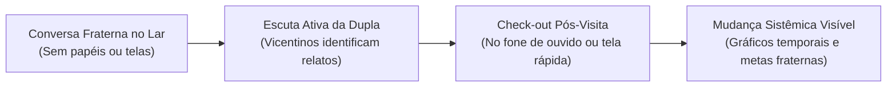
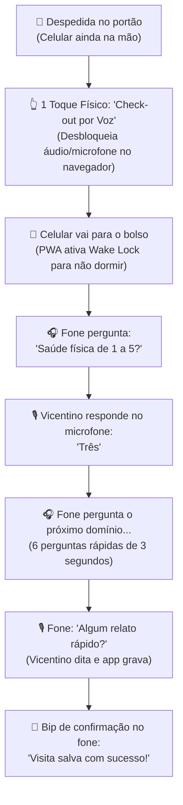

# Registro de Chat - Dicionário de Dados Canônico, Modelo Híbrido WHOQOL-100 para Visitas e Check-out por Fone de Ouvido

**Data:** 29 de Setembro de 2026  
**Participantes:** Desenvolvedor (Usuário) & Antigravity (AI)  
**Assunto Principal:** Refinamento do Dicionário de Dados Canônico (Google Sheets + IndexedDB), incorporação dos 6 domínios do WHOQOL-100 nas visitas fraternas, normalização de participantes/acompanhantes e adoção do fluxo de "Check-out no Bolso por Fone de Ouvido".

---

## 1. Contexto e Objetivos da Discussão

A discussão estabeleceu fundamentos essenciais para a arquitetura e usabilidade do **WebApp Vicentino**:
1. **Espelhamento do Banco de Dados:** Estrutura canônica e alinhada entre o armazenamento local offline ([IndexedDB](file:///c:/github/webappssvp.github.io/js/db.js)) e a nuvem privada da conferência ([Google Sheets](file:///c:/github/webappssvp.github.io/dev_local/gas/gerar_modelo_conferencia.js)).
2. **Avaliação Científica e Empática de Qualidade de Vida:** Coleta de dados sobre a evolução das famílias baseando-se no [Brazilian_WHOQOL-100.docx](file:///c:/github/webappssvp.github.io/dev_local/banco_dados/Brazilian_WHOQOL-100.docx) (OMS), com a diretriz inegociável da SSVP: **não usar formulários burocráticos ou perguntas e respostas inquisitórias**, preservando o caráter sagrado de amizade fraterna da visita domiciliar.
3. **Resiliência da Pastoral Vicentina no Registro de Presenças:** Permitir visitas individuais (quando forçado por contingências operacionais da conferência) e visitas com múltiplos acompanhantes (aspirantes, jovens da CCA e visitantes), calculando a frequência oficial para os relatórios do Conselho.
4. **Segurança Pública e Ergonomia 60+ (Check-out no Bolso):** Permitir que a dupla realize a avaliação dos 6 domínios logo após sair do lar, mantendo o celular seguro dentro do bolso e interagindo por voz através de fone de ouvido com microfone, eliminando riscos de assalto em áreas periféricas e facilitando o uso para idosos sob a luz do sol.

---

## 2. Dicionário de Dados Canônico: Tabelas Fundamentais

### 2.1. Tabela: `familias` (Núcleo Familiar Assistido)

Representa o lar assistido pela conferência.

| Campo | Tipo IndexedDB | Formato Sheets | Chave | Visibilidade no Sheets | Descrição / Regra de Negócio |
| :--- | :---: | :---: | :---: | :---: | :--- |
| `id_familia` | `string` | `@` Texto | **PK** | Legível | Identificador único estável (ex: `FM0001` ou UUID). |
| `nome_familia` | `string` | Texto | - | **Legível** | Nome de identificação (ex: `Família de Dona Neuza`). |
| `id_responsavel` | `string` | `@` Texto | **FK** | Legível | Chave referenciando o titular em `pessoas.id_pessoa`. |
| `endereco_rua_num`| `string` | Texto | - | 🔒 **Cifrado AES** | Logradouro e número (dado pessoal protegido). |
| `bairro` | `string` | Texto | - | **Legível** | Bairro do atendimento (legível para filtros e rotas). |
| `cidade_uf` | `string` | Texto | - | **Legível** | Município e Estado (ex: `São Paulo/SP`). |
| `cep` | `string` | `@` Texto | - | 🔒 **Cifrado AES** | CEP para georreferenciamento e validações. |
| `latitude` | `number` | Numérico | - | Legível | Coordenada geográfica para roteirização de visitas. |
| `longitude` | `number` | Numérico | - | Legível | Coordenada geográfica para roteirização de visitas. |
| `tipo_moradia` | `string` | Dropdown | - | Legível | `propria`, `alugada`, `cedida`, `ocupacao`, `area_risco`. |
| `status_familia`| `string` | Dropdown | - | Legível | `em_atendimento`, `promovida`, `afastada`, `sindicancia`. |
| `data_inicio` | `string` | `yyyy-mm-dd` | - | Legível | Data do primeiro acolhimento pela conferência. |
| `data_promocao` | `string` | `yyyy-mm-dd` | - | Legível | Data de autonomia e conclusão da assistência. |
| `atualizado_em` | `string` | Timestamp ISO | - | Legível | Carimbo de data/hora para controle de sync offline. |
| `status_sinc` | `string` | Dropdown | - | Legível | `sincronizado`, `pendente_sync`, `conflito`. |
| `excluido_logico`| `boolean` | Booleano | - | Legível | Flag de exclusão suave para preservar integridade. |

---

### 2.2. Tabela: `pessoas` (Vicentinos, Assistidos e Benfeitores)

Cadastro unificado de indivíduos para evitar duplicidade de papéis.

| Campo | Tipo IndexedDB | Formato Sheets | Chave | Visibilidade no Sheets | Descrição / Regra de Negócio |
| :--- | :---: | :---: | :---: | :---: | :--- |
| `id_pessoa` | `string` | `@` Texto | **PK** | Legível | Identificador único (ex: `PS0001` ou UUID). |
| `nome_exibicao` | `string` | Texto | - | **Legível** | Nome social / primeiro nome (ex: `Dona Neuza`, `Irmão Carlos`). |
| `nome_completo` | `string` | Texto | - | 🔒 **Cifrado AES** | Nome civil completo protegido por criptografia de ponta. |
| `cpf_cripto` | `string` | Texto | - | 🔒 **Cifrado AES** | Documento cifrado com chave da conferência. |
| `cpf_hash` | `string` | Texto | - | Legível | Hash HMAC SHA-256 para busca de duplicidade sem expor o CPF. |
| `genero` | `string` | Dropdown | - | Legível | `M`, `F`, `Outro`. |
| `data_nasc` | `string` | `yyyy-mm-dd` | - | Legível | Usado para cálculo automático de faixa etária (idosos 60+, crianças). |
| `telefone` | `string` | `@` Texto | - | 🔒 **Cifrado AES** | Contato telefônico / WhatsApp cifrado. |
| `papel_atual` | `string` | Dropdown | - | Legível | `assistido`, `socorrido`, `vicentino`, `benfeitor`. |
| `cargo_atual` | `string` | Dropdown | - | Legível | `presidente`, `vice`, `secretario`, `tesoureiro`, `nenhum`. |
| `escolaridade` | `string` | Dropdown | - | Legível | Diagnóstico educacional para planos de qualificação. |
| `ocupacao` | `string` | Texto | - | Legível | `aposentado`, `desempregado`, `autonomo`, `clt`, `bpc`. |
| `atualizado_em` | `string` | Timestamp ISO | - | Legível | Metadado de sincronização. |
| `status_sinc` | `string` | Dropdown | - | Legível | Metadado de sincronização. |
| `excluido_logico`| `boolean` | Booleano | - | Legível | Exclusão lógica. |

---

## 3. Metodologia: WHOQOL-100 Adaptado à Visita Vicentina

O documento [Brazilian_WHOQOL-100.docx](file:///c:/github/webappssvp.github.io/dev_local/banco_dados/Brazilian_WHOQOL-100.docx) organiza a qualidade de vida em **6 Domínios** e **24 Facetas**:

### Mapeamento das Falas Espontâneas para as Facetas da OMS:

| Domínio WHOQOL | Facetas no Documento | O que a Família fala na conversa do dia a dia |
| :--- | :--- | :--- |
| **I. Físico** | F1 (Dor), F2 (Energia/cansaço), F3 (Sono) | *"Minha coluna tem doído muito"*, *"Não consigo dormir com a preocupação"*, *"Ando sem disposição"*. |
| **II. Psicológico** | F4 (Sentimentos positivos), F6 (Autoestima), F8 (Sentimentos negativos) | *"Às vezes me dá um desânimo e choro à toa"*, *"Tenho fé que as coisas vão melhorar"*. |
| **III. Independência** | F9 (Mobilidade), F10 (Atividades diárias), F11 (Remédios), F12 (Trabalho) | *"Falta dinheiro para comprar o remédio de pressão"*, *"Consegui um bico de diarista"*, *"Tenho dificuldade para subir a escada"*. |
| **IV. Relações Sociais** | F13 (Relações pessoais), F14 (Apoio social) | *"A vizinha me ajuda a olhar os netos"*, *"Me sinto muito sozinho, ninguém me visita além de vocês"*. |
| **V. Ambiente e Moradia** | F16 (Segurança), F17 (Lar/moradia), F18 (Finanças/alimentação), F19 (Saúde SUS), F23 (Transporte) | *"O telhado está com goteira no quarto"*, *"O ônibus demora 2 horas"*, *"A comida do mês já acabou"*, *"Não consigo vaga no posto"*. |
| **VI. Espiritualidade** | F24 (Fé, sentido da vida e crenças) | *"A oração da noite é o que me sustenta"*, *"Perdi a esperança em tudo"*. |

---

## 4. O "Modelo Híbrido": Termômetros Rápidos + Chips de Escuta

Adotou-se o **Modelo Híbrido** para unir simplicidade e profundidade:
1. **6 Termômetros Visuais (1 a 5):** preenchidos logo após a visita (por toque na tela ou no fone).
2. **Chips de Escuta Fraterna:** botões de toque único ativados apenas quando o tema surgir na conversa.
3. **Acionamento da Mudança Sistêmica:** notas vulneráveis (1 ou 2) ou chips críticos geram atalhos para metas no **Plano de Promoção**.

---

## 5. Estrutura Refinada da Tabela: `visitas`

A tabela `visitas` armazena o evento principal da visita, o vicentino responsável (relator) e a mensuração de qualidade de vida:

| Campo | Tipo IndexedDB | Formato Sheets | Chave | Visibilidade no Sheets | Descrição / Regra de Negócio |
| :--- | :---: | :---: | :---: | :---: | :--- |
| `id_visita` | `string` | `@` Texto | **PK** | Legível | Identificador único estável (`VS0001` ou UUID). |
| `id_familia` | `string` | `@` Texto | **FK** | Legível | Família visitada (`familias.id_familia`). |
| `data_visita` | `string` | `yyyy-mm-dd` | - | Legível | Data em que a visita ocorreu. |
| `hora_visita` | `string` | `hh:mm` | - | Legível | Horário de início. |
| `duracao_minutos` | `number` | Numérico | - | Legível | Duração aproximada da visita em minutos. |
| **`id_vicentino_responsavel`** | `string` | `@` Texto | **FK** | Legível | Vicentino relator/líder da visita (`pessoas.id_pessoa`). Se foi sozinho, é o próprio vicentino. |
| `relato_escuta` | `string` | Texto | - | 🔒 **Cifrado AES** | Diálogo e confidências da família (sigilo vicentino). |
| `necessidades` | `string` | Texto | - | 🔒 **Cifrado AES** | Demandas relatadas de saúde, moradia ou alimentação. |
| `ajuda_entregue` | `string` | Texto | - | Legível | Resumo dos itens entregues (ex: `1 Cesta Básica, Leite`). |
| `qv_fisico` | `number` (1..5)| Inteiro | - | Legível | Termômetro de dor, energia e sono (F1, F2, F3). |
| `qv_psicologico` | `number` (1..5)| Inteiro | - | Legível | Termômetro de humor, autoestima e ânimo (F4 a F8). |
| `qv_independencia`| `number` (1..5)| Inteiro | - | Legível | Termômetro de autonomia e trabalho (F9 a F12). |
| `qv_relacoes` | `number` (1..5)| Inteiro | - | Legível | Termômetro de convívio familiar e rede de apoio (F13, F14). |
| `qv_ambiente` | `number` (1..5)| Inteiro | - | Legível | Termômetro de moradia, finanças e saneamento (F16 a F23).|
| `qv_espiritual` | `number` (1..5)| Inteiro | - | Legível | Termômetro de esperança, fé e sentido da vida (F24). |
| `qv_chips_alerta` | `array` / `string`| Texto `@` | - | Legível | Tags de facetas ativadas (ex: `F11_REMEDIO, F17_HAB`). |
| `status_visita` | `string` | Dropdown | - | Legível | `realizada`, `cancelada`, `reagendada`. |
| `atualizado_em` | `string` | Timestamp ISO | - | Legível | Metadado de sincronização. |
| `status_sinc` | `string` | Dropdown | - | Legível | Metadado de sincronização. |
| `excluido_logico` | `boolean` | Booleano | - | Legível | Exclusão lógica. |

---

## 5.1. Tabela: `visitas_participantes` (Acompanhantes e Papéis)

Registra os demais participantes que acompanharam o responsável na visita:

| Campo | Tipo IndexedDB | Formato Sheets | Chave | Visibilidade no Sheets | Descrição / Regra de Negócio |
| :--- | :---: | :---: | :---: | :---: | :--- |
| `id_participacao` | `string` | `@` Texto | **PK** | Legível | Identificador único (`VP0001` ou UUID). |
| `id_visita` | `string` | `@` Texto | **FK** | Legível | Visita correspondente (`visitas.id_visita`). |
| `id_pessoa` | `string` | `@` Texto | **FK** | Legível | Participante acompanhante (`pessoas.id_pessoa`). |
| `papel_na_visita` | `string` | Dropdown | - | Legível | `dupla_oficial`, `aspirante`, `jovem_cca`, `visitante`. |
| `atualizado_em` | `string` | Timestamp ISO | - | Legível | Metadado de sincronização. |
| `status_sinc` | `string` | Dropdown | - | Legível | Metadado de sincronização. |
| `excluido_logico` | `boolean` | Booleano | - | Legível | Exclusão lógica. |

### Regra de Negócio:
* **Visita Individual:** O vicentino logado é gravado em `visitas.id_vicentino_responsavel`. A tabela `visitas_participantes` **não recebe registros**, economizando linhas de planilha e tráfego.
* **Visita Acompanhada:** Cada acompanhante gera 1 linha em `visitas_participantes` com o seu respectivo papel.
* **Apuração de Presenças:** $\text{Total} = \text{COUNT}(visitas_{\text{responsavel}}) + \text{COUNT}(visitas\_participantes_{\text{pessoa}})$.

---

## 6. Estrutura da Tabela: `plano_promocao` (Metas Fraternas e Sonhos)

Registra as metas combinadas com a família para superação da vulnerabilidade (Mudança Sistêmica):

| Campo | Tipo IndexedDB | Formato Sheets | Chave | Visibilidade no Sheets | Descrição / Regra de Negócio |
| :--- | :---: | :---: | :---: | :---: | :--- |
| `id_meta` | `string` | `@` Texto | **PK** | Legível | Identificador único (ex: `PL0001` ou UUID). |
| `id_familia` | `string` | `@` Texto | **FK** | Legível | Família titular da meta (`familias.id_familia`). |
| `id_pessoa` | `string` | `@` Texto | **FK** | Legível | Membro específico do lar vinculado à meta (opcional). |
| `origem_visita` | `string` | `@` Texto | **FK** | Legível | Visita onde surgiu a demanda (`visitas.id_visita`). |
| `dimensao_whoqol` | `string` | Dropdown | - | Legível | `fisico`, `psicologico`, `independencia`, `social`, `ambiente`, `espiritual`. |
| `tipo_item` | `string` | Dropdown | - | Legível | `sonho_do_lar`, `meta_especifica`, `acao_semanal`. |
| `descricao` | `string` | Texto | - | **Legível** | O que foi combinado (ex: *Marcar cardiologista no posto*). |
| `prazo_estimado` | `string` | `yyyy-mm-dd` | - | Legível | Data limite acordada fraternamente com a família. |
| `status` | `string` | Dropdown | - | Legível | `em_andamento`, `cumprida`, `renegociada`, `cancelada`. |
| `obstaculo_real` | `string` | Texto | - | 🔒 **Cifrado AES** | Motivo fraterno de não ter conseguido (ex: *Netos sem aula*). |
| `solucao_combinada`| `string`| Texto | - | **Legível** | Novo acordo (ex: *Deixar com a Dona Rosa na terça*). |
| `data_conclusao` | `string` | `yyyy-mm-dd` | - | Legível | Data em que a meta foi atingida. |
| `atualizado_em` | `string` | Timestamp ISO | - | Legível | Metadado de sincronização. |
| `status_sinc` | `string` | Dropdown | - | Legível | Metadado de sincronização. |
| `excluido_logico` | `boolean` | Booleano | - | Legível | Exclusão lógica. |

---

## 7. Arquitetura do "Check-out no Bolso por Fone de Ouvido"

Para garantir que a avaliação seja feita logo após a visita (quando a memória das entrelinhas está totalmente fresca), sem expor o voluntário a riscos de segurança pública em áreas periféricas e sem exigir leitura em telas pequenas sob a luz do sol:

### 7.1. Requisitos Técnicos Web (PWA):
1. **O "Toque de Ignição":** Em conformidade com as políticas do iOS Safari e Android Chrome, a captura e reprodução de áudio são ativadas a partir de um único toque consciente do usuário no botão *"Check-out no Fone"* antes de guardar o aparelho.
2. **Prevenção de Suspensão (`Screen Wake Lock API`):** Mantém o PWA ativo no bolso durante a sequência de áudio sem que o sistema operacional desligue a execução.
3. **Web Speech API Nativa:**
   * **Saída (`SpeechSynthesis`):** Sintetiza a pergunta no fone com voz serena e ritmo adaptado a idosos.
   * **Entrada (`SpeechRecognition`):** Reconhece respostas numéricas ("um" a "cinco") com tolerância a ruído ambiente.
4. **Extração de Chips Automática por Fala:** Termos mencionados no relato livre (como *"pressão"*, *"remédio"*, *"goteira"*, *"desemprego"*) ativam automaticamente as tags correspondentes no banco de dados.

---

## 8. Decisões Arquiteturais Registradas

1. **Check-out Imediato Hands-Free:** Aprovada a inclusão da funcionalidade de check-out por fone com microfone para segurança pessoal e ergonomia 60+.
2. **Duas Vias de Check-out:** O vicentino pode escolher:
   * **Via Tela Rápida:** Grade de botões grandes (48x48px) de alto contraste para quem preferir tocar na tela.
   * **Via Fone no Bolso:** Diálogo falado de 35 segundos para quem estiver caminhando na rua.
3. **Persistência Imediata Offline:** Todos os dados do check-out caem instantaneamente no IndexedDB local antes de qualquer tentativa de sincronização com o Google Sheets.
